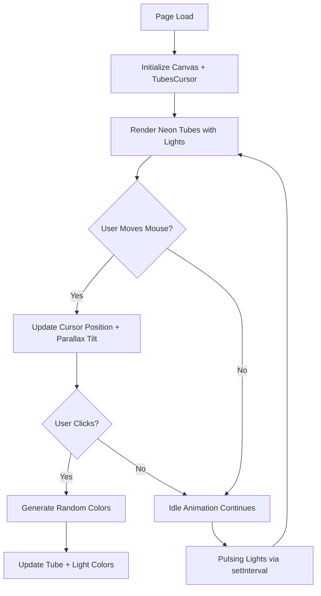

# 🌌 NeonFlux – Tubes Cursor Animation  
**_Made with ❤️ by Anshuman_**

> An interactive 3D cursor experience that turns motion into art — glowing tubes that dance with your cursor, powered by `Three.js` and a splash of chaos magic (a.k.a JavaScript).

---

## 🚀 Overview
**NeonFlux** is a futuristic, light-based animation built using the `threejs-components` library.  
It transforms your cursor into flowing neon tubes, smoothly following your motion while reacting dynamically to user clicks.  
Every click reshuffles colors in real time, creating a living digital canvas.

The result?  
A **cyber-aesthetic** playground blending motion, color, and 3D geometry — perfect for creative portfolios, landing pages, or interactive art.

---

## 🧠 Core Concept

| Feature | Description |
|----------|--------------|
| 💫 **Cursor Tubes** | Reactive tubular shapes that follow your mouse path using vector motion |
| 🌈 **Dynamic Colors** | Every click triggers randomized new colors for the tubes & lights |
| 🔦 **Lighting System** | Ambient and directional lights with adjustable intensity & hue |
| 🧭 **Parallax Hero Section** | Hero text that tilts and moves with your mouse using CSS variables |
| ⚡ **Bloom & Glow** | Three.js bloom post-processing adds glow to everything |
| 🎛️ **Smooth Transitions** | Uses trigonometric pulsing and interpolation for continuous motion |

---

## 🧩 File Structure

```

neonflux/
│
├── index.html          # Main HTML container
├── style.css           # Styling and 3D visual effects
├── script.js           # Animation logic and event handling
└── README.md           # You're reading it ✨

````

---

## 🧱 Code Description

### 🟣 **index.html**
The structure of the app — sets up the `canvas` for Three.js rendering and the `.hero` section overlay.

Key elements:
```html
<div id="app">
  <canvas id="canvas"></canvas>
  <div class="hero">
    <h1>Tubes</h1>
    <h2>Cursor</h2>
    <a href="https://www.framer.com/marketplace/components/tubes-cursor/" target="_blank">View on Framer</a>
  </div>
</div>
````

💡 The `<canvas>` is where Three.js draws glowing tubes.
The `.hero` section sits above it, creating a clean 3D parallax text layer.

---

### 🔵 **style.css**

Defines the **visual theme** — gradients, blur, text effects, and motion.

Key highlights:

* Gradient text with flowing animation
* `backdrop-filter: blur()` for frosted-glass effect
* Responsive typography with `clamp()`
* 3D tilt controlled by CSS custom props (`--rx`, `--ry`)

---

### 🟢 **script.js**

The heart of NeonFlux.

1. **Imports TubesCursor**

   ```js
   import TubesCursor from "https://cdn.jsdelivr.net/npm/threejs-components@0.0.19/build/cursors/tubes1.min.js";
   ```

2. **Initializes Canvas**

   ```js
   const app = TubesCursor(canvas, {
     tubes: {
       count: 12,
       colors: ["#ff00d4", "#00eaff", "#00ff9d"],
       speed: 1.2,
       radius: 0.007,
       lights: {
         intensity: 250,
         colors: ["#ff00aa", "#00d9ff", "#aaff00", "#ff8800"]
       }
     },
     motion: { parallax: 0.02, smoothness: 0.07 },
     bloom: { strength: 0.9, radius: 0.5, threshold: 0.1 }
   });
   ```

3. **Handles Color Randomization on Click**

   ```js
   document.body.addEventListener("click", () => {
     const colors = randomColors(3);
     const lightsColors = randomColors(4);
     app.tubes.setColors(colors);
     app.tubes.setLightsColors(lightsColors);
   });
   ```

4. **Parallax Tilt**

   ```js
   document.addEventListener('mousemove', e => {
     const x = (e.clientX / innerWidth - 0.5) * 2;
     const y = (e.clientY / innerHeight - 0.5) * 2;
     hero.style.setProperty('--rx', `${y * -10}deg`);
     hero.style.setProperty('--ry', `${x * 10}deg`);
   });
   ```

5. **Pulsing Light Effect**

   ```js
   setInterval(() => {
     const t = Date.now() * 0.002;
     app.tubes.lights.intensity = 200 + Math.sin(t) * 80;
   }, 50);
   ```

6. **Random Color Generator**

   ```js
   function randomColors(count) {
     return Array.from({ length: count }, () =>
       "#" + Math.floor(Math.random() * 16777215).toString(16).padStart(6, "0")
     );
   }
   ```

---

## 🧩 Mermaid Flowchart

Here’s how NeonFlux flows from load → animation → user interaction:



---

## 🔮 Visual Demo

> *Open `index.html` in your browser and move your cursor. Click anywhere to trigger color bursts!*

---

## 🧑‍💻 Tech Stack

* **HTML5** – Core structure
* **CSS3** – Gradients, blur, parallax, and responsive layout
* **JavaScript (ES Modules)** – Interaction logic
* **Three.js Components** – Renders the glowing tubes

---

## 🧠 Future Enhancements

* 🌌 Add multi-cursor support (multiple light trails)
* 🔥 Integrate music visualization for audio-reactive motion
* 🧩 Toggle between visual themes (Cyber, Galaxy, Neon Pulse)
* ⚙️ Add controls UI for speed and color intensity

---

## ❤️ Credits

Made with pure passion by **Anshuman**
Inspired by [Framer Components](https://www.framer.com/marketplace/components/tubes-cursor/)
Built using **Three.js Components** and **modern web motion design principles**

---

## 🪄 License

This project is open source under the **MIT License** — free to use, remix, and explore.

---

## ✨ Final Words

> “Where code meets light, imagination begins.”
> Welcome to **NeonFlux.**

```


